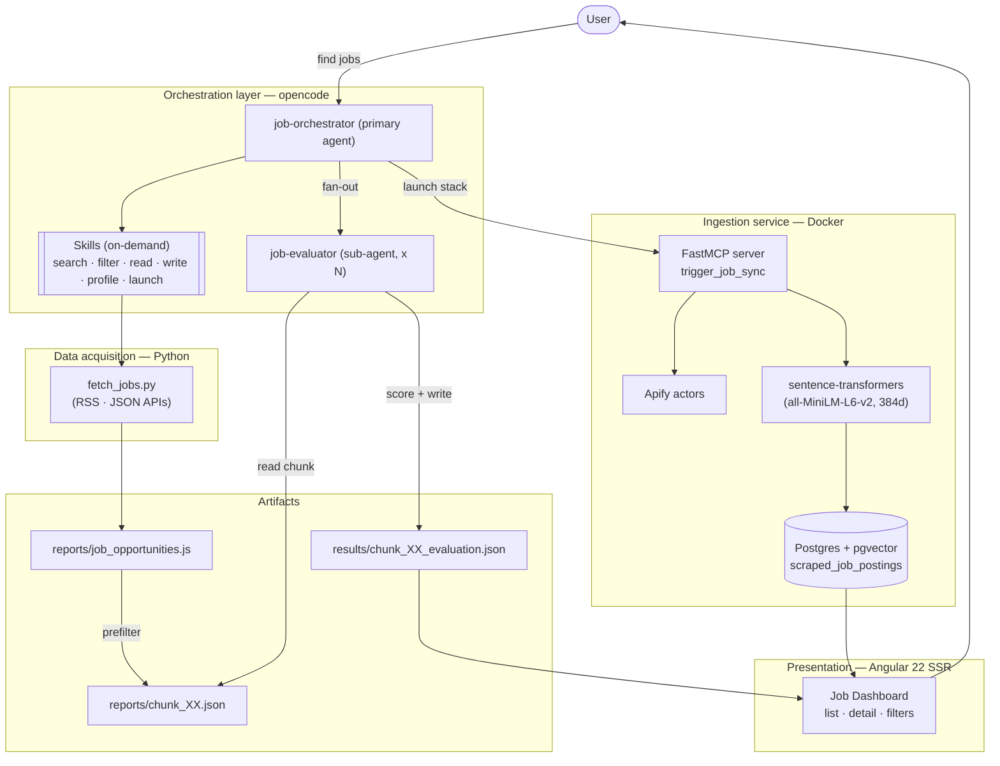
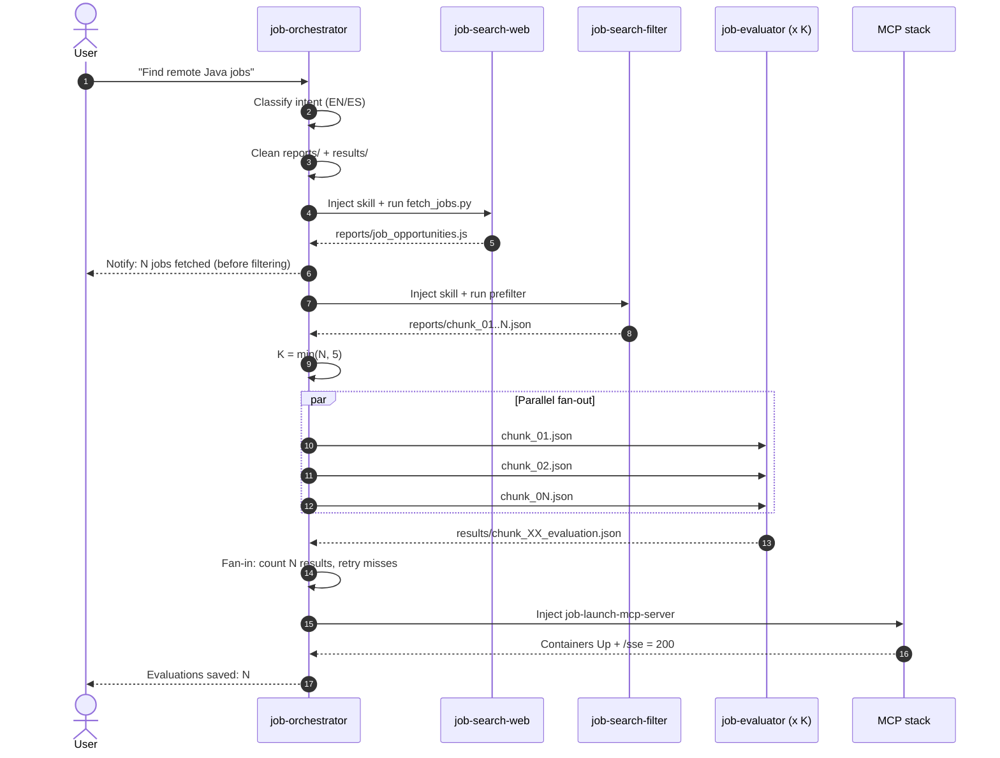
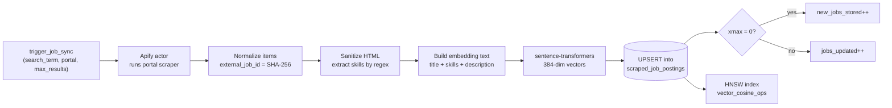
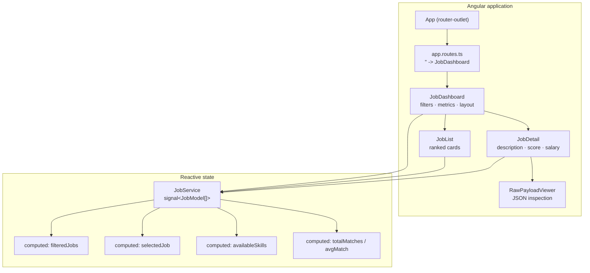

# Agent Hunter Job

> A multi-agent platform that searches job boards, scores every posting against a
> candidate profile, persists the results in a vector database, and visualizes the
> ranked opportunities in a dashboard.

`agent_hunter_job` is an end-to-end job-hunting pipeline orchestrated by AI agents.
It combines a **skill-driven multi-agent orchestrator**, a **Python ingestion gateway
that exposes an MCP server over a pgvector store**, and an **Angular 22 dashboard**
that turns the raw offers into a filterable, scored shortlist.

---

## Table of contents

- [Why this project](#why-this-project)
- [Features](#features)
- [High-level architecture](#high-level-architecture)
- [Multi-agent orchestration](#multi-agent-orchestration)
- [Ingestion pipeline (MCP + pgvector)](#ingestion-pipeline-mcp--pgvector)
- [Frontend architecture](#frontend-architecture)
- [Repository structure](#repository-structure)
- [Data model](#data-model)
- [Scoring rubric](#scoring-rubric)
- [Tech stack](#tech-stack)
- [Getting started](#getting-started)
- [Design decisions](#design-decisions)
- [Roadmap](#roadmap)

---

## Why this project

Job hunting at senior level is a **filtering problem**: hundreds of postings,
most irrelevant, across dozens of boards. Doing this manually is slow and
inconsistent. Agent Hunter Job automates the loop:

1. **Discover** — fetch live offers from public feeds and APIs.
2. **Reduce** — keyword-prefilter to remove noise before spending LLM tokens.
3. **Judge** — score each remaining candidate against a structured profile.
4. **Persist** — embed and store postings for semantic search.
5. **Visualize** — present a ranked, filterable dashboard to the user.

The design goal is **cheap, parallel, auditable**: deterministic scripts do the
heavy lifting, and LLM agents are reserved for the judgement step, running in
bounded parallel fan-out with a strict fan-in contract.

---

## Features

- **Skill-driven orchestration** — the primary agent classifies intent and injects
  only the skills it needs, on demand (never preloaded).
- **Parallel evaluation** — up to 5 `job-evaluator` sub-agents run concurrently,
  each owning a disjoint set of chunk files.
- **Deterministic ETL scripts** — Python scripts parse, normalize, chunk, read and
  write intermediate artifacts with well-defined exit codes.
- **MCP ingestion gateway** — a FastMCP server triggers Apify scrapers, embeds
  postings locally, and upserts them into Postgres + pgvector.
- **Local embeddings** — `sentence-transformers/all-MiniLM-L6-v2` (384 dims),
  CPU-only Torch, model baked into the image for offline startup.
- **HNSW vector index** — fast approximate cosine-similarity search over postings.
- **Angular 22 + SSR dashboard** — signals-based state, standalone components,
  responsive master/detail UI with keyword, skill, remote and sort filters.

---

## High-level architecture



---

## Multi-agent orchestration

The orchestrator follows a fixed, deterministic flow. The key idea is that
**the orchestrator never evaluates jobs itself** — it plans, dispatches and
verifies, while sub-agents do the per-chunk work.



**Invariants enforced by the flow**

- Skills are injected **on demand**, never preloaded.
- The user is **notified before** the filter runs (overwrites are part of the flow).
- `reports/` (every stale file) and `results/` are both cleaned **once** by the
  orchestrator at the start, before the fetch (step 3) — the filter skill and
  sub-agents never delete anything; evaluators only write their own
  `<chunk>_evaluation.json` (a full clean would wipe siblings and break the fan-in count).
- Fan-in verifies `N` result files via a **file count**, never by opening them.
- Max **5** concurrent evaluators to stay within rate limits.

### Roles

| Agent | Mode | Responsibility |
|-------|------|----------------|
| `job-orchestrator` | primary | Classify intent, run scripts, fan-out/fan-in, launch MCP stack |
| `job-evaluator` | sub-agent | Score each candidate in one chunk against the profile, write the report |

### Skills

Skills are the composable capabilities the agents inject as needed.

| Skill | Script / input | Output |
|-------|----------------|--------|
| `job-search-commands` | intent rules (EN/ES) | routing decision |
| `job-search-web` | `fetch_jobs.py` | `reports/job_opportunities.js`, `raw_jobs_DATE.json` |
| `job-search-filter` | `prefilter_job_opportunities.py` | `reports/chunk_XX.json` (5 jobs each) |
| `job-read-chunk-files` | `reader_chunk_opportunities.py` | parsed chunk object on stdout |
| `job-write-chunk-final` | `final_chunk_reporter.py` | `results/chunk_XX_evaluation.json` |
| `job-delete-all-files` | `delete_all_files_in_folder.py` | clean folders (files only, non-recursive) |
| `job-launch-mcp-server` | Docker Compose checks | DB + MCP containers Up, probe `200` |
| `user-profile` | candidate profile | fit guidance for scoring |

---

## Ingestion pipeline (MCP + pgvector)

The second half of the system persists postings for semantic search. It is exposed
as an **MCP tool** (`trigger_job_sync`) so the same orchestrator can call it.



**Design highlights**

- **Deterministic IDs** — `SHA-256` of the source id/url, so re-scrapes upsert
  instead of duplicating.
- **Skill extraction** — regex word-boundary matching against the same keyword
  list the prefilter uses, keeping ingestion and filtering in sync.
- **Connection pool** — a lazily-created `asyncpg.Pool` guarded by an
  `asyncio.Lock`, closed on lifespan shutdown.
- **Offline model** — the embedding model is downloaded at build time
  (`HF_HUB_OFFLINE=1`) so container start has no network dependency.

---

## Frontend architecture

An **Angular 22** standalone, signals-first, SSR-enabled dashboard.



**State model** — `JobService` is the single source of truth:

- `_jobs`, `_selectedJobId`, `_filters` are private `signal`s.
- Exposed as `asReadonly()`; mutations go through intent methods
  (`setKeyword`, `toggleSkill`, `setSortBy`, `loadJobs`, ...).
- Derived views (`filteredJobs`, `selectedJob`, `availableSkills`,
  `averageMatchPercentage`) are `computed()` — no manual subscriptions, no stale UI.

The dashboard ships with seeded demo data (`INITIAL_JOBS`) and exposes a
`loadJobs()` entry point so the results/evaluation reports and pgvector queries can
be wired in without touching the components.

---

## Repository structure

```text
agent_hunter_job/
├── .opencode/
│   ├── agents/                  # Agent definitions (orchestrator + evaluator)
│   ├── skills/                  # Composable capabilities, each self-contained
│   │   ├── job-search-commands/ # Intent classification rules (EN/ES)
│   │   ├── job-search-web/      # fetch_jobs.py + portal constants
│   │   ├── job-search-filter/   # prefilter_job_opportunities.py + keywords
│   │   ├── job-read-chunk-files/# reader_chunk_opportunities.py
│   │   ├── job-write-chunk-final/# final_chunk_reporter.py
│   │   ├── job-delete-all-files/# delete_all_files_in_folder.py
│   │   ├── job-launch-mcp-server/# Docker/Compose health checks
│   │   └── user-profile/        # Candidate profile + fit guidance
│   └── opportunities/           # Raw fetched jobs (raw_jobs_YYYY-MM-DD.json)
├── .github/agents/              # Mirror of the agent definitions for GitHub
├── frontend/
│   └── job-hunter-frontend/     # Angular 22 standalone + SSR dashboard
│       └── src/app/
│           ├── models/          # JobModel, filter criteria, sort options
│           ├── services/        # JobService (signals state + computed views)
│           └── components/      # dashboard, list, detail, raw-payload viewer
├── reports/                     # Pipeline artifacts
│   ├── job_opportunities.js     # Portal-grouped fetched offers
│   └── chunk_XX.json            # Prefiltered candidate chunks (5 per file)
├── results/                     # Per-chunk evaluation reports
│   └── chunk_XX_evaluation.json
├── server/
│   ├── mcp-server/              # FastMCP ingestion gateway (Python)
│   │   ├── server.py            # MCP tool: trigger_job_sync
│   │   ├── job_ingestion.py     # Scrape, embed, upsert logic
│   │   ├── config.py            # Env-driven configuration
│   │   ├── Dockerfile           # CPU-only Torch + baked model
│   │   └── requirements.txt
│   ├── mcp_server_postgres_vector.yml  # Compose: jobs-db + jobs-mcp-server
│   └── init.sql                 # pgvector schema + HNSW index
├── opencode.json                # Permissions for scripts and folders
└── README.md
```

---

## Data model

`scraped_job_postings` (Postgres 16 + `pgvector`):

| Column | Type | Notes |
|--------|------|-------|
| `id` | `UUID` | PK, `gen_random_uuid()` |
| `external_job_id` | `VARCHAR(255)` | SHA-256 of source id/url |
| `source_portal` | `VARCHAR(50)` | e.g. `linkedin`, `WeWorkRemotely_Backend` |
| `title`, `company`, `location` | `VARCHAR` | |
| `is_remote` | `BOOLEAN` | inferred from location when absent |
| `salary_min`, `salary_max`, `currency` | `NUMERIC` / `VARCHAR` | |
| `clean_description` | `TEXT` | HTML stripped, whitespace collapsed |
| `required_skills` | `TEXT[]` | regex-extracted keywords |
| `raw_payload` | `JSONB` | original posting, retained verbatim |
| `embedding` | `vector(384)` | all-MiniLM-L6-v2 |
| `scraped_at` | `TIMESTAMPTZ` | refresh timestamp |

**Constraints & indexes**

- `UNIQUE (external_job_id, source_portal)` → idempotent upserts.
- `idx_jobs_embedding_hnsw` — HNSW index over `embedding vector_cosine_ops`
  for fast approximate nearest-neighbour search.

### Pipeline artifacts

| File | Producer | Consumer |
|------|----------|----------|
| `reports/job_opportunities.js` | `job-search-web` | `job-search-filter` |
| `reports/chunk_XX.json` | `job-search-filter` | `job-evaluator` (via reader) |
| `results/chunk_XX_evaluation.json` | `job-evaluator` | frontend / fan-in |

---

## Scoring rubric

Each candidate is scored `0–100` and labelled `APPLY` / `CONSIDER` / `SKIP`.

| Weight | Dimension |
|-------:|-----------|
| 40 | Technical stack match (Java, Spring Boot, microservices, REST, Angular/Vue/TS) |
| 25 | Seniority & architecture (senior/lead, system design, modernization) |
| 20 | Domain (banking / fintech / enterprise / modernization) |
| 15 | Applied AI & modernization (Spring AI, multi-agent, orchestration) |

| Score | Recommendation |
|------:|----------------|
| 80–100 | `APPLY` |
| 60–79 | `CONSIDER` |
| 0–59 | `SKIP` |

Every report entry keeps the candidate's original fields (verbatim) and adds
`id`, `score`, `recommendation`, `pros` and `cons` — `pros` are evidence-backed
matches, `cons` are honest mismatches (empty when there are none).

---

## Tech stack

| Layer | Technology |
|-------|------------|
| Orchestration | opencode agents + skills (Markdown-driven) |
| Acquisition scripts | Python 3.12 (`urllib`, `xml.etree`, `asyncio`) |
| Ingestion service | FastMCP (`mcp`), `asyncpg`, `apify-client` |
| Embeddings | `sentence-transformers` (`all-MiniLM-L6-v2`, 384d), CPU Torch |
| Storage | PostgreSQL 16 + `pgvector` (HNSW, cosine) |
| Containerization | Docker Compose |
| Frontend | Angular 22, standalone components, signals, SSR, Vitest |

---

## Getting started

### Prerequisites

- Docker + Docker Compose
- Python 3.11+
- Node.js (Angular 22 requires a modern Node) + npm
- An [Apify](https://apify.com/) token

### 1. Run the agent pipeline

Open the project in an opencode session and simply ask for jobs:

```text
Find remote Java / Spring Boot job opportunities
```

The orchestrator will fetch, prefilter, fan out to the evaluators and write the
results into `results/`.

### 2. Launch the MCP ingestion stack

Create `server/.env` with a real token, then start the stack:

```bash
echo "APIFY_TOKEN=apify_api_xxx" > server/.env
docker compose -f server/mcp_server_postgres_vector.yml up -d --build
```

Health check:

```bash
curl -s -m 3 -o /dev/null -w "%{http_code}\n" http://127.0.0.1:3000/sse   # -> 200
```

The MCP tool `trigger_job_sync(search_term, location, portal, max_results, skills, actor_ids)`
scrapes, embeds and upserts postings into `scraped_job_postings`.

### 3. Run the frontend

```bash
cd frontend/job-hunter-frontend
npm install
npm start          # http://localhost:4200
npm test           # Vitest
npm run build      # production + SSR bundle
```

---

## Design decisions

- **Deterministic scripts over eager LLM calls.** Parsing, normalization, chunking
  and persistence are pure Python. LLMs are only used where judgement is required,
  which keeps cost and latency predictable.
- **Two-stage filtering.** A keyword prefilter (`FILTER_KEYWORDS`) discards the
  obvious noise before any chunk reaches an agent — cheap recall now, precise
  scoring later.
- **Shared filesystem contract.** Sub-agents never return bulky payloads in prose;
  they read from `reports/` and write to `results/` through validated scripts with
  explicit exit codes. This makes the fan-in a simple, verifiable file count.
- **Bounded parallelism.** A hard cap of 5 concurrent evaluators respects provider
  rate limits while still collapsing N chunks of work.
- **Idempotent ingestion.** Content-addressed `external_job_id` + `ON CONFLICT`
  upserts mean re-running the pipeline is safe and cheap.
- **Reactive, typed frontend state.** Angular signals provide derived state with
  zero manual subscription management and full type-safety over `JobModel`.
- **Local embeddings.** No embedding API dependency: the model ships in the image,
  runs on CPU, and the vectors live next to the data in pgvector.

---

## Roadmap

- [ ] Wire the frontend to real data (`loadJobs()` from `results/` / a REST read
      endpoint backed by pgvector similarity queries).
- [ ] Add a query endpoint that ranks postings by cosine similarity to a profile
      embedding directly in the dashboard.
- [ ] Expose the evaluation pipeline as a callable endpoint so the dashboard can
      trigger a fresh run.
- [ ] Persist evaluation reports into Postgres for history and trend tracking.
- [ ] Add CI (lint + tests for Python scripts and the Angular app).

---

## License

_Add your license here (e.g. MIT)._ Built as a personal portfolio project.
